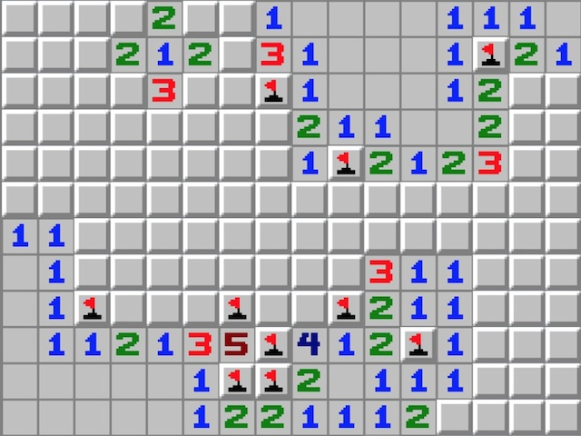

[Overview](#Overview "Overview")
---------------------------------------------

My final project for CS133B is to make a fully functional minesweeper
clone. The class uses Visual Basic, so that will be the language I am
going to make the game in.

I've already gotten a start on the game, and I will make some updates to
this post including the things I've learned and updated with the
project.

[Progress](#Progress "Progress")
---------------------------------------------

### [2017-11-13](#2017-11-13 "2017-11-13")

Today I finished setting up code so the buttons form rows on loading the
form. I've never really dynamically added elements to a form up to this
point so it was a learning experience. Here is a little bit of code
(simplified) to do that:

```vb
Const GAME_SIZE = 9 ' How many rows and colums, TODO: Add x and y for game size.

Dim btn As Button
Dim intCols As Integer
Dim intRows As Integer
Dim intButtonSize = 20

For intCols = 0 To GAME_SIZE - 1 
    For intRows = 0 To GAME_SIZE - 1
        btn = New Button()
        btn.Top = intCols * intButtonSize
        btn.Left = intRows * intButtonSize
        btn.Size = New Size(intButtonSize, intButtonSize)
        
        Me.Controls.Add(btnCell)
    Next
Next
```

Another thing I learned about was a ternary-esque syntax in VB. For
example:

```vb
Dim x As String = "Hello"
Dim result As String

result = If(x = "Hello", "World", "Hello") ' ternary like syntax in VB
```

Now that I'm sure that this is a feasible project, I'm going to need to
type out the plans before I go any further. Such as an IPO chart,
pseudocode, and a controls chart.